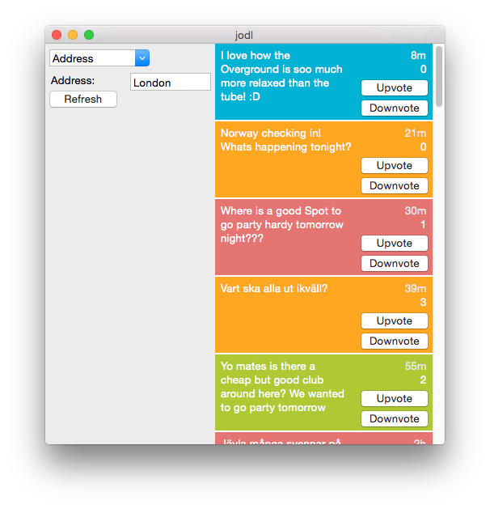

A computer interface for the Jodel app, written in Python with wxPython. `jodl.py` is a Python interface for the Jodel API, but is not included in the repository since the developers don't want the API to be public (it is however not especially hard to figure it out).

